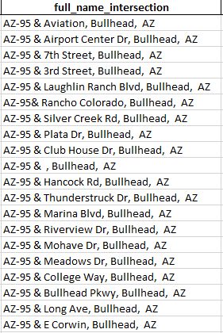

1. Please execute files 1) generate_intersection_from_UTDFCombined, 2) geo_referencing and 3) macro_node_matching in order.
2. The input file is UTDF combined csv and the output is movement_synchro.csv

NOTE:

In order to make high accuracy fo geocoding, plase prepare your intersection_from_synchro.csv as suggested:

if you can provide the column named: full_name_intersection,

plase prepare the format like:

if you don't have, you need to make you have two columns named: intersection_name and city_name,

pleae preapre the format like:

