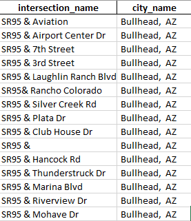

1. Please execute files 1) generate_intersection_from_UTDFCombined, 2) geo_referencing and 3) macro_node_matching in order.
2. The input file is UTDF combined csv and the output is movement_synchro.csv

NOTE:

In order to make high accuracy for geocoding, plase prepare your intersection_from_synchro.csv as suggested:

You have to prepare two columns named: intersection_name and city_name (The reason not a combined column name is that we need to validate intersection name before geocoding)

please preapre the format like:

### Georeferencing Code Logic

Three-way validation

Step1: calculate result_1(longitude and latitude) using intersection_name and city_name (eg. SR95 & Aviation, Bullhead, AZ)

Step2: calculate result_2(longitude and latitude) using **reversed** intersection_name and city_name (eg. Aviation & SR95, Bullhead, AZ)

If results of step1 and step2 are same, use result_1(longitude and latitude) and finish.

If results are not equal:

    if the distance between result_1 and result_2 within the threshould, use result_1 and finish

    else, use three-points-validation-methods to generate longitude and latitude.
